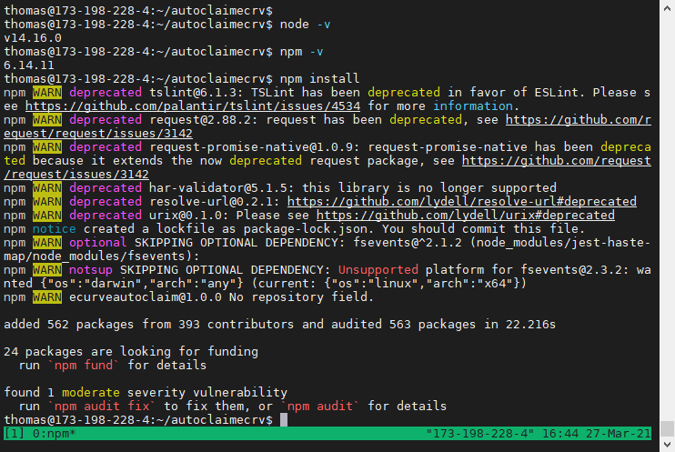

# AutoClaim eCRV

I wrote this script so that I will get the most out of eCRV rewards by automatically claiming every hour. It is set to run every minute. Rewards are calculated and given at the bottom of every hour. There are configurations you can use to increase the interval.

## Settings

Create a `.env` file and add these settings.  

#### PRIVATEKEY
It is highly recommended that you create a separate key that gives permissions for ONLY the actions that this script will perform. Unless you can guarantee security of the server, like you are running it from your local network, you should not use your active key in this script.  

#### ACCOUNTNAME
This is your EOS account name

#### PERMISSION
This is the permission.  

#### INTERVAL
This is the interval the script will run, in milliseconds. 1000 = 1 second. I have mine set to 60000 which is 1 minute.  

The file should look like this:
```dotenv
PRIVATEKEY=yourPrivateKey
ACCOUNTNAME=yourAcctName
PERMISSION=yourPermission
INTERVAL=60000 #this is ok to leave at 60000, that will be every minute
```

## Setup Service
Please contact me on Telegram (`@tvle83`), and I can help set up a server for this script. The process is very quick, and your private key will never be exposed to me. Everything can be set up, and the private key can be added by you, after I am done. 

If you are setting this up yourself and do not have an account at DigitalOcean or Vultr, please consider using my referral link:

Digital Ocean: https://m.do.co/c/fd67d238a7c4

Vultr: https://www.vultr.com/?ref=8832658-6G

## Self-Setup

Recommended is the $5 tier of either Digital Ocean or Vultr, or equivelent. 

Recommended OS: 
Linux, specifically Ubuntu which is available at Digital Ocean and Vultr.

Recommended packages:
- `vim` or `nano` (a text editor)
- tmux (https://github.com/tmux/tmux)
- nvm (node version manager) ( https://github.com/nvm-sh/nvm )

Install vim and tmux
```bash
sudo apt-get install vim tmux -y
```

Install NVM
```bash
curl -o- https://raw.githubusercontent.com/nvm-sh/nvm/v0.37.2/install.sh | bash
```

Once the installation is complete it will tell you to run this command

```bash
export NVM_DIR="$HOME/.nvm"
[ -s "$NVM_DIR/nvm.sh" ] && \. "$NVM_DIR/nvm.sh"  # This loads nvm
[ -s "$NVM_DIR/bash_completion" ] && \. "$NVM_DIR/bash_completion"  # This loads nvm bash_completion
```
After that is complete run this command

`source ~/.bashrc`

I recommend using `tmux` so that you can exit the server and the script will still be running. 

`tmux`


The tmux program is a way to keep the terminal session open. You can have multiple sessions in the same window and then leave and return to the terminal sessions at will.

To exit tmux you must type `ctrl+b, d` this means press ctrl and b at the same time, take your fingers off the keyboard then press d. this is for `detatch`. 

To get back into that session you will run the command `tmux a -t 0` 
- `a` is for attach
- `-t` is for the terminal session
- `0` is for the id of the terminal session

You can get a list of terminal sessions by running `tmux ls`.

Back in the tmux session clone this repository with `git clone https://github.com/tvl83/autoclaimecrv`

```
cd autoclaimecrv
```

Let's verify we have node and npm installed.
```bash
node -v
```

```bash
npm -v
```


Your version numbers won't necessarily match exactly, but should be equal or higher than these numbers.

```bash
npm install
```


At this  point it's just about ready to start. Make sure you created the `.env` file or else it will error.

```
nano .env
```

Edit the values after the `=` and do not add spaces, do not change the ALL CAP words either. 

To quit nano use the shortcuts at the bottom `Write Out` means save so `ctrl+o` and press enter to confirm and then `ctrl+x` to exit nano.

```bash
npm run start
```

this command will start the script. With the default setting of `60000`ms delay it will take 1 minute to run for the first time

There is another command that will write to a log file instead of to the console. Both do exactly the same thing except where the log information goes. This could be helpful for troubleshooting. 

```bash
npm run startlog
```

To quit the program at any time you just press `ctrl+c`

## Questions/Comments

If there are issues or feature requests for this project please use the github issues tab. 

`@tvle83` on telegram

I also run https://DaddyDAO.io for the DAD community. I am a software developer and on the msig for the DAO.

If you find this script useful and would like to donate to me I greatly appreciate it.

My FIO Address is `thomas@edge` for BTC, ETH, USDT.

My EOS address is `thomassamoht`.


